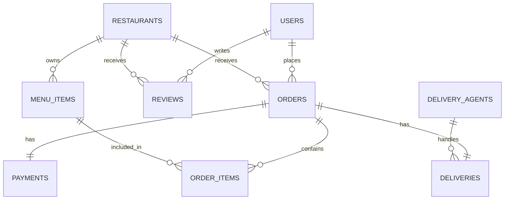

# 🍔 CraveBite - Enterprise Food Delivery Engine

CraveBite is a high-performance, full-stack food delivery platform that prioritizes **Raw SQL Power** and **Premium User Experience**. Built with a Zomato-inspired aesthetic, it features a cinematic landing page, a secure 2-step OTP authentication system, and a real-time Admin Command Center.

---

## 🚀 Key Features

- **Premium UI/UX**: Dark-themed glassmorphism interface with cinematic Ken Burns hero animations.
- **Secure Auth**: 2-Step OTP-based authentication for consumers and secure Email/Password guard for Admins.
- **Real-Time Admin Dashboard**: Live KPI tracking, revenue analytics via Recharts, and user/order management.
- **Theme Engine**: Persistent Light/Dark mode with brand-consistent accents.
- **SQL-First Architecture**: Business logic (rating calculations, delivery assignments, order processing) is handled directly by PostgreSQL triggers and procedures.

---

## 🛠 Tech Stack

- **Frontend**: React 18, Tailwind CSS v4, Framer Motion, Recharts, Zustand.
- **Backend**: Node.js (TypeScript), Express.js, JWT.
- **Database**: PostgreSQL (No ORM - Pure SQL).
- **Icons**: Lucide React.

---

## 📊 Database Architecture (The SQL Core)

This project is a showcase of advanced PostgreSQL capabilities. We avoid ORMs to leverage the full power of relational database features.

### Entity Relationship Diagram



### 🧠 SQL Objects & Concepts

#### 1. Views (Abstraction Layer)
- **`top_restaurants_view`**: Uses `RANK()` window functions to prioritize restaurants based on ratings and review volume.
- **`popular_items_view`**: Aggregates sales data to identify trend-setting dishes.
- **`order_summary_view`**: A complex 4-way JOIN that provides a human-readable snapshot of every transaction.

#### 2. Stored Procedures (Atomic Transactions)
- **`place_order`**: An atomic procedure that accepts a JSON payload of items, calculates totals, inserts order records, and initializes payment state in a single transaction.
- **`assign_delivery`**: Encapsulates the logic for finding an available agent and updating system state synchronously.

#### 3. Triggers (Event-Driven Logic)
- **`update_restaurant_rating`**: Automatically recalculates restaurant averages whenever a new review is posted.
- **`update_agent_availability`**: Dynamically releases delivery agents back into the pool when an order is marked 'Delivered'.

#### 4. Constraints & Optimization
- **Check Constraints**: Enforces business rules (e.g., quantities must be > 0).
- **Partial Indexes**: Optimized for status-based lookups (e.g., `idx_orders_status`).
- **Enums**: Strict typing for order and payment statuses.

---

## ⚙️ Installation & Setup

### 1. Database Initialization
```bash
# Create the database
createdb food_delivery

# Run the schema and seed data
psql -d food_delivery -f backend/db/schema.sql
psql -d food_delivery -f backend/db/seed.sql
```

### 2. Backend Environment
Navigate to `/backend`:
```bash
npm install
npm run dev
```
*Server runs at `http://localhost:5001`*

### 3. Frontend Environment
Navigate to `/frontend`:
```bash
npm install
npm run dev
```
*Client runs at `http://localhost:5173`*

---

## 🛡 Security & Access

### Consumer Access
- **Landing Page**: `/`
- **Order Page**: `/restaurants`
- **Login**: `/login` (via 2-Step OTP)

### Admin Command Center
- **Login**: `/admin/login`
- **Dashboard**: `/admin/dashboard`
- **Credentials**: `admin@cravebite.com` / `admin123`

---

## 📸 Project Snapshots

- **Cinematic Hero**: Smooth Unsplash-powered image slideshow with Ken Burns zoom effects.
- **Real-Time Stats**: Admin KPIs update every 30 seconds without page refresh.
- **Dynamic Theming**: One-click toggle between sleek dark mode and high-contrast light mode.

---

### 📝 SQL Schema Reference

| Table | Primary Key | Key Foreign Keys |
|---|---|---|
| `users` | `user_id` | - |
| `restaurants` | `restaurant_id` | - |
| `menu_items` | `item_id` | `restaurant_id` |
| `orders` | `order_id` | `user_id`, `restaurant_id` |
| `order_items` | `order_item_id` | `order_id`, `item_id` |
| `deliveries` | `delivery_id` | `order_id`, `agent_id` |
| `payments` | `payment_id` | `order_id` |

---
*Created with ❤️ for Bangalore's Foodies.*
