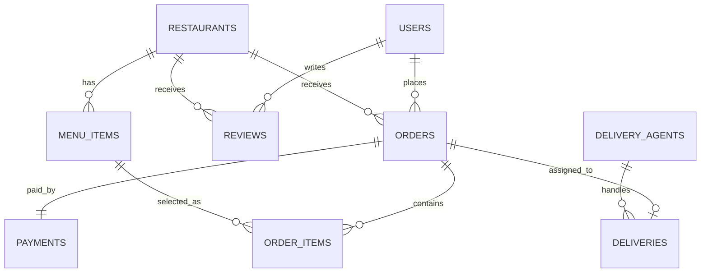

# CraveBite - SQL-Based Online Food Delivery System

CraveBite is a full-stack food delivery project built around a PostgreSQL database. The main purpose of the project is to show how a real food ordering system can be designed using relational tables, constraints, views, triggers, stored procedures, and SQL joins.

The application has a React frontend for customers and admins, an Express TypeScript backend, and a PostgreSQL database that stores users, restaurants, menus, orders, payments, deliveries, reviews, and delivery agents.

## Project Highlights

- Customer flow: browse restaurants, view menus, add items to cart, place orders, and track order status.
- Admin flow: view orders, revenue, popular items, top restaurants, and operational KPIs.
- SQL-first backend: the database contains business logic through triggers, stored procedures, enums, views, constraints, and indexes.
- No ORM: backend queries PostgreSQL directly using the `pg` package.
- Seeded Bangalore food delivery dataset with users, restaurants, menu items, orders, payments, deliveries, agents, and reviews.

## Tech Stack

| Layer | Technology |
|---|---|
| Frontend | React, TypeScript, Vite, Tailwind CSS, Framer Motion, Zustand, Recharts |
| Backend | Node.js, Express, TypeScript, JWT, Zod |
| Database | PostgreSQL, PL/pgSQL, SQL views, triggers, stored procedures |
| Deployment | Vercel for frontend, Render for backend and PostgreSQL |

## Folder Structure

```text
online food delivery/
  backend/
    db/
      schema.sql
      seed.sql
    src/
      config/
      middleware/
      modules/
      utils/
  frontend/
    public/
    src/
      api/
      components/
      pages/
      store/
```

## Database Design

The database is the most important part of this project. It is designed as a normalized relational system where each major food delivery concept has its own table.

Main database file:

```text
backend/db/schema.sql
```

Seed data file:

```text
backend/db/seed.sql
```

## Entity Relationship Diagram



## Database Tables and Schemas

### 1. `users`

Stores customer account information.

| Column | Type | Constraint / Purpose |
|---|---|---|
| `user_id` | `SERIAL` | Primary key |
| `name` | `VARCHAR(255)` | Required customer name |
| `email` | `VARCHAR(255)` | Unique and required |
| `password` | `VARCHAR(255)` | Hashed password |
| `phone` | `VARCHAR(20)` | Customer phone number |
| `address` | `TEXT` | Delivery address |
| `created_at` | `TIMESTAMP` | Defaults to current timestamp |

### 2. `restaurants`

Stores restaurant details shown in the app.

| Column | Type | Constraint / Purpose |
|---|---|---|
| `restaurant_id` | `SERIAL` | Primary key |
| `name` | `VARCHAR(255)` | Required restaurant name |
| `cuisine_type` | `VARCHAR(100)` | Cuisine category |
| `city` | `VARCHAR(100)` | Restaurant city |
| `rating` | `DECIMAL(3,2)` | Defaults to `0`; updated by review trigger |
| `delivery_time_mins` | `INT` | Estimated delivery time |
| `is_open` | `BOOLEAN` | Defaults to `TRUE` |
| `image_url` | `TEXT` | Restaurant image |

### 3. `menu_items`

Stores food items that belong to restaurants.

| Column | Type | Constraint / Purpose |
|---|---|---|
| `item_id` | `SERIAL` | Primary key |
| `restaurant_id` | `INT` | Foreign key to `restaurants.restaurant_id`, cascade delete |
| `name` | `VARCHAR(255)` | Required item name |
| `description` | `TEXT` | Item description |
| `price` | `DECIMAL(10,2)` | Required item price |
| `category` | `VARCHAR(100)` | Food category |
| `is_veg` | `BOOLEAN` | Defaults to `TRUE` |
| `is_available` | `BOOLEAN` | Defaults to `TRUE` |
| `image_url` | `TEXT` | Item image |

### 4. `orders`

Stores order headers and current status.

| Column | Type | Constraint / Purpose |
|---|---|---|
| `order_id` | `SERIAL` | Primary key |
| `user_id` | `INT` | Foreign key to `users.user_id`, cascade delete |
| `restaurant_id` | `INT` | Foreign key to `restaurants.restaurant_id`, cascade delete |
| `total_amount` | `DECIMAL(10,2)` | Required order total |
| `status` | `order_status` | Defaults to `Placed` |
| `created_at` | `TIMESTAMP` | Defaults to current timestamp |

### 5. `order_items`

Stores the items inside each order. This table solves the many-to-many relationship between `orders` and `menu_items`.

| Column | Type | Constraint / Purpose |
|---|---|---|
| `order_item_id` | `SERIAL` | Primary key |
| `order_id` | `INT` | Foreign key to `orders.order_id`, cascade delete |
| `item_id` | `INT` | Foreign key to `menu_items.item_id`, cascade delete |
| `quantity` | `INT` | Required, must be greater than `0` |
| `unit_price` | `DECIMAL(10,2)` | Price captured at order time |

### 6. `delivery_agents`

Stores delivery partner details.

| Column | Type | Constraint / Purpose |
|---|---|---|
| `agent_id` | `SERIAL` | Primary key |
| `name` | `VARCHAR(255)` | Required agent name |
| `phone` | `VARCHAR(20)` | Agent phone number |
| `vehicle` | `vehicle_type` | Bike, Bicycle, or Scooter |
| `is_available` | `BOOLEAN` | Defaults to `TRUE` |
| `rating` | `DECIMAL(3,2)` | Agent rating |

### 7. `deliveries`

Stores delivery assignment and timing details.

| Column | Type | Constraint / Purpose |
|---|---|---|
| `delivery_id` | `SERIAL` | Primary key |
| `order_id` | `INT` | Unique foreign key to `orders.order_id`, cascade delete |
| `agent_id` | `INT` | Foreign key to `delivery_agents.agent_id`, set null on delete |
| `pickup_time` | `TIMESTAMP` | Pickup timestamp |
| `delivered_time` | `TIMESTAMP` | Delivery completion timestamp |
| `distance_km` | `DECIMAL(5,2)` | Delivery distance |

### 8. `reviews`

Stores customer reviews for restaurants.

| Column | Type | Constraint / Purpose |
|---|---|---|
| `review_id` | `SERIAL` | Primary key |
| `user_id` | `INT` | Foreign key to `users.user_id`, cascade delete |
| `restaurant_id` | `INT` | Foreign key to `restaurants.restaurant_id`, cascade delete |
| `rating` | `INT` | Must be between `1` and `5` |
| `comment` | `TEXT` | Review text |
| `created_at` | `TIMESTAMP` | Defaults to current timestamp |

### 9. `payments`

Stores one payment record for each order.

| Column | Type | Constraint / Purpose |
|---|---|---|
| `payment_id` | `SERIAL` | Primary key |
| `order_id` | `INT` | Unique foreign key to `orders.order_id`, cascade delete |
| `amount` | `DECIMAL(10,2)` | Required payment amount |
| `method` | `payment_method` | UPI, Card, Cash, or Wallet |
| `status` | `payment_status` | Defaults to `Pending` |
| `paid_at` | `TIMESTAMP` | Payment completion time |

## SQL Enums

| Enum | Values |
|---|---|
| `order_status` | `Placed`, `Confirmed`, `Preparing`, `Out for Delivery`, `Delivered`, `Cancelled` |
| `vehicle_type` | `Bike`, `Bicycle`, `Scooter` |
| `payment_method` | `UPI`, `Card`, `Cash`, `Wallet` |
| `payment_status` | `Pending`, `Success`, `Failed` |

## SQL Relationships

| Relationship | Meaning |
|---|---|
| `users` -> `orders` | One user can place many orders |
| `users` -> `reviews` | One user can write many reviews |
| `restaurants` -> `menu_items` | One restaurant has many menu items |
| `restaurants` -> `orders` | One restaurant can receive many orders |
| `restaurants` -> `reviews` | One restaurant can receive many reviews |
| `orders` -> `order_items` | One order can contain many items |
| `menu_items` -> `order_items` | One menu item can appear in many orders |
| `orders` -> `payments` | One order has one payment record |
| `orders` -> `deliveries` | One order can have one delivery record |
| `delivery_agents` -> `deliveries` | One delivery agent can handle many deliveries |

## SQL Views

### `top_restaurants_view`

Ranks restaurants by rating and review count.

Used for:

- Showing top-rated restaurants.
- Combining restaurant details with review count.
- Demonstrating `RANK()` and `GROUP BY`.

### `popular_items_view`

Shows the top-selling menu items based on order quantities.

Used for:

- Admin analytics.
- Understanding which dishes sell most.
- Demonstrating joins between `menu_items`, `order_items`, and `restaurants`.

### `order_summary_view`

Creates a readable order report by joining users, restaurants, orders, and payments.

Used for:

- Admin order table.
- Reporting order status and payment status together.
- Avoiding repeated joins in backend code.

## SQL Triggers

### `after_review_insert`

Runs the `update_restaurant_rating()` function after a review is inserted.

What it does:

- Finds the average rating for the reviewed restaurant.
- Updates `restaurants.rating` automatically.
- Keeps restaurant ratings accurate without manual backend calculation.

### `after_order_delivered`

Runs the `update_agent_availability()` function when an order status changes.

What it does:

- If an order becomes `Delivered`, the assigned delivery agent becomes available again.
- Updates the delivery completion time.
- Keeps delivery agent availability consistent with order status.

## Stored Procedures

### `place_order(p_user_id, p_restaurant_id, p_items, p_order_id)`

Creates an order from a JSON array of items.

Example item payload:

```json
[
  { "item_id": 1, "quantity": 2, "unit_price": 150.00 },
  { "item_id": 4, "quantity": 1, "unit_price": 90.00 }
]
```

What the procedure does:

- Calculates total amount from quantity and unit price.
- Inserts a row into `orders`.
- Inserts rows into `order_items`.
- Creates a pending payment row.
- Returns the generated order id.

### `assign_delivery(p_order_id)`

Assigns an available delivery agent to an order.

What the procedure does:

- Selects an available delivery agent.
- Inserts a row into `deliveries`.
- Marks the agent as unavailable.
- Updates order status to `Out for Delivery`.
- Throws an error if no delivery agent is available.

## Indexes and Constraints

| Object | Purpose |
|---|---|
| `idx_orders_user_id` | Speeds up customer order history queries |
| `idx_orders_status` | Speeds up admin status filtering |
| `idx_menu_items_restaurant_id` | Speeds up menu lookup by restaurant |
| `UNIQUE users.email` | Prevents duplicate accounts |
| `CHECK order_items.quantity > 0` | Prevents invalid order quantities |
| `CHECK reviews.rating BETWEEN 1 AND 5` | Keeps ratings valid |
| `UNIQUE deliveries.order_id` | Allows only one delivery per order |
| `UNIQUE payments.order_id` | Allows only one payment per order |

## Local Setup

### 1. Create and seed the database

```bash
createdb food_delivery
psql -d food_delivery -f backend/db/schema.sql
psql -d food_delivery -f backend/db/seed.sql
```

### 2. Configure backend environment

Create `backend/.env`:

```env
NODE_ENV=development
PORT=5001
DB_USER=postgres
DB_PASSWORD=postgres
DB_HOST=localhost
DB_PORT=5432
DB_NAME=food_delivery
JWT_SECRET=change-this-local-secret
REFRESH_TOKEN_SECRET=change-this-refresh-secret
```

### 3. Run backend

```bash
cd backend
npm install
npm run dev
```

Backend runs on:

```text
http://localhost:5001
```

### 4. Run frontend

Create `frontend/.env`:

```env
VITE_API_URL=http://localhost:5001/api
```

Then run:

```bash
cd frontend
npm install
npm run dev
```

Frontend runs on:

```text
http://localhost:5173
```

## Demo Access

Admin login:

```text
Email: admin@cravebite.com
Password: admin123
```

Seeded customer users use:

```text
Password: password123
```

Example seeded customer:

```text
rahul@example.com
```

## Deployment Plan: Render Backend + PostgreSQL

Use Render for the backend API and PostgreSQL database.

### Step 1: Create PostgreSQL on Render

1. Go to Render dashboard.
2. Create a new PostgreSQL database.
3. Copy the external database URL.
4. Load the SQL files into the Render database:

```bash
psql "YOUR_RENDER_DATABASE_URL" -f backend/db/schema.sql
psql "YOUR_RENDER_DATABASE_URL" -f backend/db/seed.sql
```

### Step 2: Create backend web service on Render

Use these settings:

| Setting | Value |
|---|---|
| Root directory | `backend` |
| Build command | `npm install && npm run build` |
| Start command | `npm start` |
| Runtime | Node |

### Step 3: Add backend environment variables on Render

```env
NODE_ENV=production
PORT=10000
DATABASE_URL=your_render_postgres_external_database_url
JWT_SECRET=use-a-long-random-secret
REFRESH_TOKEN_SECRET=use-another-long-random-secret
JWT_EXPIRES_IN=1h
REFRESH_TOKEN_EXPIRES_IN=7d
```

Notes:

- The backend supports `DATABASE_URL` for Render deployment.
- SSL is enabled automatically when `NODE_ENV=production`.
- Redis is optional. If `REDIS_URL` is not configured, the server continues without Redis.

### Step 4: Confirm backend health

After deployment, check that the API URL is reachable:

```text
https://your-render-service.onrender.com/api/restaurants
```

## Deployment Plan: Vercel Frontend

Use Vercel for the React frontend.

### Step 1: Import project into Vercel

Use these settings:

| Setting | Value |
|---|---|
| Framework preset | Vite |
| Root directory | `frontend` |
| Build command | `npm run build` |
| Output directory | `dist` |
| Install command | `npm install` |

### Step 2: Add frontend environment variable

```env
VITE_API_URL=https://your-render-service.onrender.com/api
```

### Step 3: Deploy

Deploy the frontend after the backend URL is ready. This prevents frontend API calls from pointing to localhost.

### Step 4: Verify routes

Open:

```text
https://your-vercel-app.vercel.app
```

Test:

- Landing page loads.
- Restaurant list loads from Render API.
- Login works.
- Cart and order flow work.
- Admin dashboard loads after admin login.

## Common Deployment Errors and Fixes

| Error | Cause | Fix |
|---|---|---|
| Frontend calls localhost | Missing `VITE_API_URL` on Vercel | Set `VITE_API_URL` to Render API URL and redeploy |
| Database connection fails | Wrong database URL or missing SSL | Use Render PostgreSQL external URL and `NODE_ENV=production` |
| Tables do not exist | Schema was not loaded into production database | Run `schema.sql`, then `seed.sql` with `psql` |
| Admin dashboard has no data | Seed file not loaded | Run `backend/db/seed.sql` |
| Build fails on Render | Wrong root directory | Set root directory to `backend` |
| Build fails on Vercel | Wrong root directory | Set root directory to `frontend` |

## Why This Is a SQL Project

This project is not just a CRUD app. The database handles important business rules:

- Ratings are recalculated automatically with triggers.
- Delivery agents are released automatically when orders are delivered.
- Orders can be created through a stored procedure.
- Admin analytics use SQL views and joins.
- Enums keep statuses and payment methods valid.
- Constraints prevent invalid quantities and ratings.

That makes the PostgreSQL schema the core of the system, while the backend and frontend act as layers around it.
